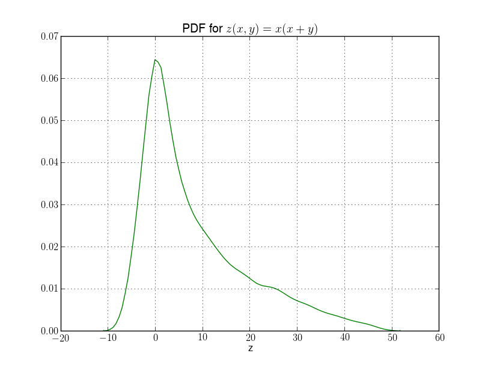
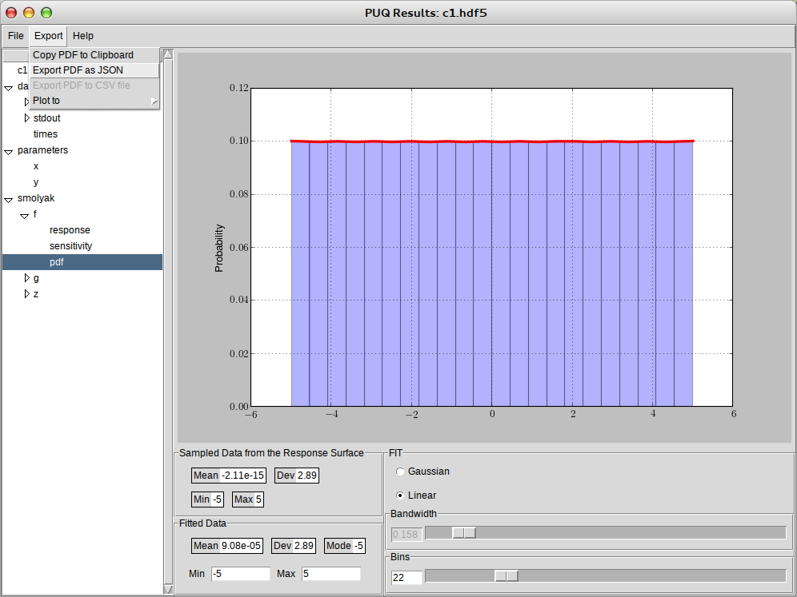
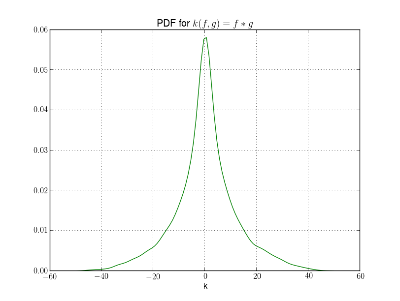

Handling Correlated PDFs
------------------------

PUQ assumes input parameters are independent, but sometimes this is not true.  In that case, you need to have either a
Joint PDF, or a large number of samples drawn from that Joint PDF.  In this section we'll show how to take two correlated output
PDFs from one PUQ run and use them as inputs to another PUQ run.

These examples are from puq/examples/correlated.  The first simulation, which creates obviously correlated outputs is c1_prog.py.

.. literalinclude:: ../../../examples/correlated/c1_prog.py
    :linenos:
    :language: python

This has three outputs, **f**, **g**, and **z**, which will be created as PDFs by *PUQ*.

The input script is

.. literalinclude:: ../../../examples/correlated/c1.py
    :linenos:
    :language: python

Lets run *PUQ* and create the PDFs::

	~/puq/examples/correlated> puq start -f c1.hdf5 c1.py
	Saving run to c1.hdf5

	Processing <HDF5 dataset "f": shape (13,), type "<f8">
		Surface   = 1.0*x
		RMSE      = 1.07e-12 (1.07e-11 %)

	SENSITIVITY:
	Var      u*            dev
	-----------------------------
	x    1.0000e+01    9.7391e-12
	y    0.0000e+00    0.0000e+00

	Processing <HDF5 dataset "g": shape (13,), type "<f8">
		Surface   = x + y
		RMSE      = 1.52e-12 (7.59e-12 %)

	SENSITIVITY:
	Var      u*            dev
	-----------------------------
	y    1.0000e+01    9.7391e-12
	x    1.0000e+01    9.7391e-12

	Processing <HDF5 dataset "z": shape (13,), type "<f8">
		Surface   = x*(x + y)
		RMSE      = 7.59e-12 (1.52e-11 %)

	SENSITIVITY:
	Var      u*            dev
	-----------------------------
	x    5.5178e+01    6.8073e+01
	y    2.5000e+01    3.5355e+01

As you can see, PUQ correctly generated each response surface.  Let's look at **z**. ::

	~/puq/examples/correlated> puq plot -v z c1.hdf5

OK.  So far things look good.  The second simulation takes **f** and **g** as input PDFs and
outputs **f*g**.  So it should look the same as **z**.  However, **f** and **g** are very correlated
so it won't work as we expect.  But before we try that, we need to save **f** and **g** to files. ::

	~/puq/examples/correlated> puq analyze c1.hdf5

Save **f** and **g** to f.json and g.json.

You can look at c2_prog.py and verify it simply multiplies the two input parameters.  Then take
a look at c2.py.

.. literalinclude:: ../../../examples/correlated/c2.py
    :linenos:
    :language: python

For the first run, change lines 4 and 5 so use_samples is False. This is the default and
will cause the input parameters to be treated as independent.  Then run **puq** ::

	~/puq/examples/correlated> puq start -f c2_indep.hdf5 c2.py
	Saving run to c2_indep.hdf5

	Processing <HDF5 dataset "k": shape (13,), type "<f8">
		Surface   = 1.0*f*g
		RMSE      = 7.92e-14 (7.96e-14 %)

	SENSITIVITY:
	Var      u*            dev
	-----------------------------
	f    4.9775e+01    7.0000e+01
	g    4.9498e+01    7.0000e+01

The response surface is correct (f*g). Looking at the output, **k**, ::

	~/puq/examples/correlated> puq plot -v k c2_indep.hdf5

This looks nothing like the plot for **z**.  Now let's try it with correlated input parameters.  Change c2.py back so
lines 4 and 5 have the use_samples arg set to True.

.. literalinclude:: ../../../examples/correlated/c2.py
    :linenos:
    :language: python

::

   ~/puq/examples/correlated> puq start -f c2.hdf5 c2.py
	Saving run to c2.hdf5

	Processing <HDF5 dataset "k": shape (13,), type "<f8">
		Surface   = 1.0*f*g
		RMSE      = 7.92e-14 (7.96e-14 %)

	SENSITIVITY:
	Var      u*            dev
	-----------------------------
	f    4.9775e+01    7.0000e+01
	g    4.9498e+01    7.0000e+01

	~/puq/examples/correlated> puq plot -v k c2.hdf5

.. figure:: images/correlated_k2.png
   :width: 500px
   :align: left

This looks very much like the plot for **z** we got in the first section.  For a better comparison, you can use *puq analyze* to save **z** and **k** to files, then do ::

	~/puq/examples/correlated> puq read -c z.json k.json

.. figure:: images/correlated-compare.png
   :width: 500px
   :align: left

