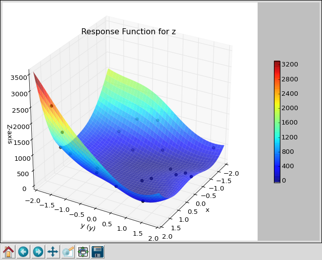
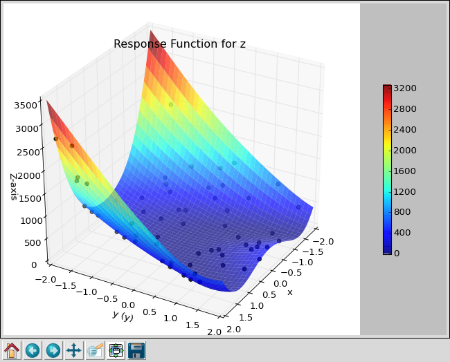

Latin Hypercube Sampling
========================

Latin Hypercube Sampling is an improvement over Monte Carlo Sampling. In
one dimension, it generates numbers that are evenly spaced in probability.
For multiple dimensions, the numbers are randomly paired, so there is more
randomness in the output. However it avoids clusters and generally outperforms Monte Carlo.

If you looked at the previous section on :doc:`mc`, you will need to make just
a minor change to your control script to use Latin Hypercube Sampling.

Change the line that says::

   uq = MonteCarlo([x,y], num=num)

to::

   uq = LHS([x,y], num=num)

Or use 'rosen_lhs.py' in puq/examples/rosen.
::

    ~/puq/examples/rosen> puq start -f rosen_lhs.hdf5 rosen_lhs
    Saving run to rosen_lhs.hdf5

    Processing <HDF5 dataset "z": shape (20,), type "<f8">
    Mean   = 516.828
    StdDev = 634.386086052

    ~/puq/examples/rosen> puq plot -r rosen_lhs.hdf5

   Scatter plot for Rosenbrock function using LHS with 20 samples.

::

    ~/puq/examples/rosen> puq extend rosen_lhs.hdf5
	Extending rosen_lhs.hdf5 using LHS
	Extending Descriptive Sampling run to 60 samples.

    Processing <HDF5 dataset "z": shape (60,), type "<f8">
    Mean   = 495.208576132
    StdDev = 605.837656938
    ~/puq/examples/rosen> puq plot -r rosen_lhs.hdf5
    plotting z
    ~/puq/examples/rosen> puq plot rosen_lhs.hdf5
    plotting PDF for z

   Scatter plot for Rosenbrock function using LHS with 60 samples.

.. figure:: images/z-lhs-pdf.png
   :width: 500px
   :align: left

   PDF for Rosenbrock function using LHS with 60 samples.
