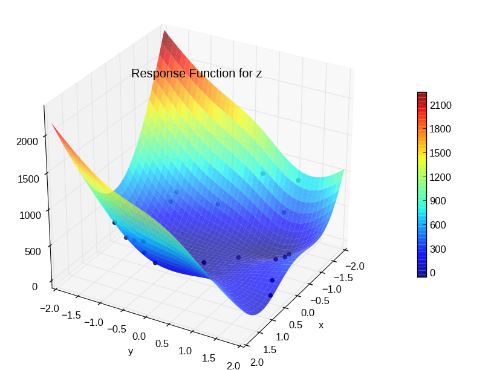
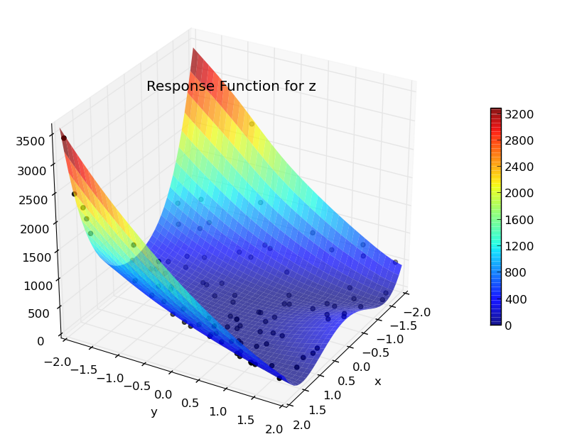
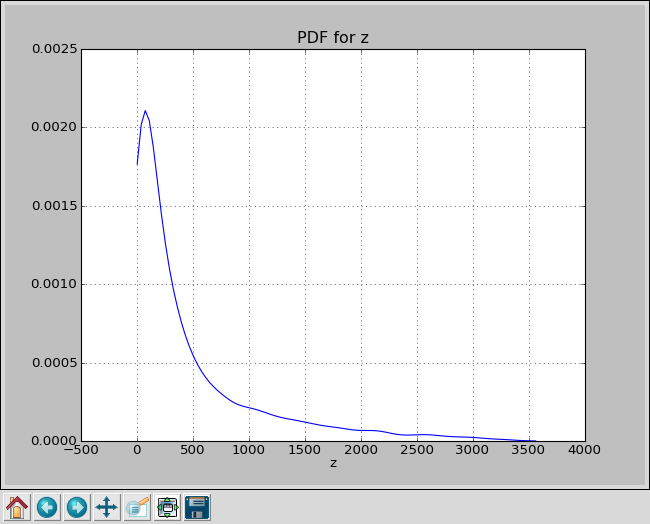

Monte Carlo Sampling
====================

This is a simple example of using PUQ with a test program written in Python.

Rather than use a complex simulation as a test program, we will use the *Rosenbrock* function.
This function is well understood and widely used as an example for optimization and UQ.
Because it can be solved analytically, it is useful as a test case for our software.

The *Rosenbrock* function is :math:`f(x,y) = 100(y-x^2)^2 + (1-x)^2`

And here is our python test program implementing it.

.. literalinclude:: ../../../examples/rosen/rosen_prog.py
    :linenos:
    :language: python

Most of the lines are concerned with parsing the command line.  By default, PUQ expects
test programs to take command line parameters in the format *--varname=value*.
This is convenient for Python programs (using the optparse module) and C/C++ (using getopt).
For existing test programs, you can easily instruct PUQ to pass parameters in another format.
See :doc:`simulations` and puq/examples/matlab.

Line 16 calls :func:`dump_hdf5` with our output. :func:`dump_hdf5` takes three arguments, a name, a value, and an optional description.
It formats the data so that PUQ can easily recognize it in standard output. It is placed in the HDF5 output file under
'output/data/varname' ('output/data/z' for our example).  If we run our test program, we get::

	~/puq/examples/rosen> ./rosen_prog.py --x=0 --y=1
	HDF5:{'name': 'z', 'value': 101.0, 'desc': ''}:5FDH

So we have a working test program.  We will limit x and y
to [-2,2] and try to calculate an output PDF.

The next step is to write a control script to set up the sweep.

Here is what we will use

.. literalinclude:: ../../../examples/rosen/rosen_mc.py
    :linenos:
    :language: python

Every control script should look basically like this.  There needs to be::

  from puq import *

to import all the required PUQ code.  There must be a function :func:`run` defined
that returns a :class:`Sweep` object. And the :class:`Sweep` object is made up of a UQ method,
a host, and a test program.

The UQ method is selected in the line::

   uq = MonteCarlo([x,y], num=num)

This tells PUQ to use the Monte Carlo method, with two parameters 'x', and
'y'. It will generate *num* random numbers each for 'x' and 'y', using a
uniform distribution over [-2,2].

Now we are ready to run.  We do this with 'puq start rosen_mc'.
Because control scripts are python scripts, the '.py' is optional.
Here are three runs, all doing 20 samples.
::

	~/puq/examples/rosen> puq start rosen_mc
	Saving run to sweep_52410436.hdf5

	Processing <HDF5 dataset "z": shape (20,), type "<f8">
	Mean   = 463.467551273
	StdDev = 499.225504146

	~/puq/examples/rosen> puq start rosen_mc 20
	Saving run to sweep_52410475.hdf5

	Processing <HDF5 dataset "z": shape (20,), type "<f8">
	Mean   = 266.371029691
	StdDev = 362.362400696

	~/puq/examples/rosen> puq start -f mc.hdf5 rosen_mc 20
	Saving run to mc.hdf5

	Processing <HDF5 dataset "z": shape (20,), type "<f8">
	Mean   = 322.364238869
	StdDev = 246.016024931

As you can see, 20 samples is not enough to get an accurate mean. To get Monte Carlo Sampling to converge
on a more accurate value, you would need to run thousands of samples. That is fine in a simple case
like the Rosenbrock function, but a complex simulation might take days or
weeks per sample.

To plot the response surface::

	~/puq/examples/rosen> puq plot -r mc.hdf5

   Scatter plot for Rosenbrock function using Monte Carlo with 20 samples.

Extending the Sample Size
-------------------------

In the example above, only 20 samples were used. If you wish to use more
samples, you can modify your control script and rerun it from the start.
However, if you do it this way, you are wasting the work that has already
been done running the 20 jobs. That might be fine for a trivial example like this,
but not for a complex simulation that ran for days to complete 20 jobs.

Fortunately you can easily add more samples to an existing Monte Carlo run::

    ~/puq/examples/rosen> puq extend --num 80 mc.hdf5
	Extending mc.hdf5 using MonteCarlo

	Processing <HDF5 dataset "z": shape (100,), type "<f8">
	Mean   = 377.988520682
	StdDev = 599.985509368

   Scatter plot for Rosenbrock function using Monte Carlo with 100 samples.

The response surface now looks more accurate although the mean is still not close to the real mean.  To plot the PDF of z, you can do::

	~/puq/examples/rosen> puq plot mc.hdf5

   PDF for Rosenbrock function using Monte Carlo with 100 samples.
