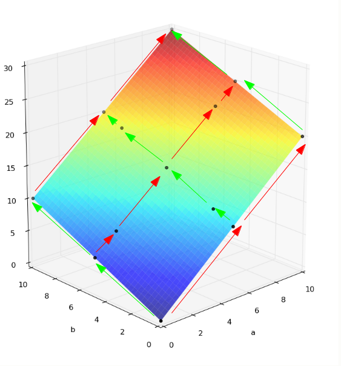

Sensitivity Analysis
====================

With any Smolyak run, sensitivity analysis is done automatically
during the analysis phase.  The elementary effects method is used on the points
in the sparse grid.  Because of the way sampling points are laid out in a grid
covering the input parameter space, the elementary effects can be computed
at no additional cost.

The sensitivity measurements are **u*** and **dev** (:math:`\sigma`). u* is the mean of the distribution of the absolute values of the elementary effects of the input factors,
:math:`\mu^* = \frac{1}{r} \sum_{j=1}^r \left| d \left( X^{(j)} \right) \right|` where :math:`d(X)` is the
elementary effect for the input parameter.  It is the overall influence of the input parameter on the output.

dev is the standard deviation of the distribution of the elementary effects for the parameter.
:math:`\sigma = \sqrt{ \frac{1}{(r-1)} \sum_{j=1}^r \left( d \left( X^{(j)} \right) - \mu  \right)^2}`
If dev is high then the input parameter's influence on the output varies widely depending on the sample point.
A linear response will have a dev of 0.

An example is shown below.

Elementary effects for input parameter **a** are computed along each red arrow.
Elementary effects for input parameter **b** are computed along each green arrow.
Each elementary effect  is the change in output value across the arrow scaled by the length.  For example,
the output goes up by 10 when **a** changed by half its range, so that elementary effect is 20. Because the above example is linear, all the elementary effects for **a** are 20.

Sensitivity test 1 has two input parameters with range [0 10]::

	~/puq/examples/sensitivity> puq start test1
	Sweep id is 30573805

	Processing <HDF5 dataset "p": shape (13,), type "<f8">
		Surface   = 2.0*a + 1.0*b
		RMSE      = 2.40e-12 (8.00e-12 %)

	SENSITIVITY:
	Var      u*            dev
	-----------------------------
	a    2.0000e+01    1.9476e-11
	b    1.0000e+01    9.7339e-12

PUQ prints the list of input variables (parameters) in order from the
highest u* to the lowest.

For more information about this method, see Elementary_Effects_ and Sensitivity_Analysis_.

.. _Elementary_Effects: http://en.wikipedia.org/wiki/Elementary_effects_method

.. _Sensitivity_Analysis: http://publications.jrc.ec.europa.eu/repository/bitstream/111111111/8571/1/7120%20-%20eur_report_handbook_2.pdf

Effect of Smolyak Level on Sensitivity
--------------------------------------

The **level** parameter to the Smolyak method sets the polynomial degree for the response surface.
A level 1 Smolyak run require only 2*ndim+1 (ndim = number of dimensions, or input parameters)
calculations and the response surface will be linear.  This will usually be a poor fit for a response surface,
bit it might be sufficient for basic sensitivity analysis.

A More Complex Example
----------------------

In Sensitivity_Analysis_, an example is worked using Sobol's g-function,

.. math::

	y=\prod_{i=1}^{k}\frac{\left|4x_{i}-2\right|+a_{i}}{1+a_{i}}\;\;\;\; x\in\left[0,1\right]^{k}

For the worked example, :math:`k=6` and :math:`a=\left[78, 12, 0.5, 2, 97, 33\right]`. The estimated sensitivity measures are:

	+----+------+-------+
	|    |  u*  |  dev  |
	+====+======+=======+
	| x3 | 1.76 |  2.05 |
	+----+------+-------+
	| x4 | 1.19 |  1.37 |
	+----+------+-------+
	| x2 | 0.28 |  0.32 |
	+----+------+-------+
	| x6 | 0.10 |  0.12 |
	+----+------+-------+
	| x1 | 0.06 |  0.06 |
	+----+------+-------+
	| x5 | 0.04 |  0.04 |
	+----+------+-------+

Using PUQ, level 1 Smolyak::

	~/puq/examples/sensitivity> puq start sobol
	Sweep id is 30605799

	SENSITIVITY:
	Var       u*            dev
	------------------------------
	x3    1.5566e+00    1.5566e+00
	x4    3.8914e-01    3.8914e-01
	x2    6.4856e-02    6.4856e-02
	x6    2.3584e-02    2.3584e-02
	x1    9.9779e-03    9.9779e-03
	x5    8.0235e-03    8.0235e-03

The estimates don't agree exactly because they use different sample points, however they do agree
on the order of significance for the inputs.  If would be easy to increase the accuracy by using a level 2 Smolyak grid.

