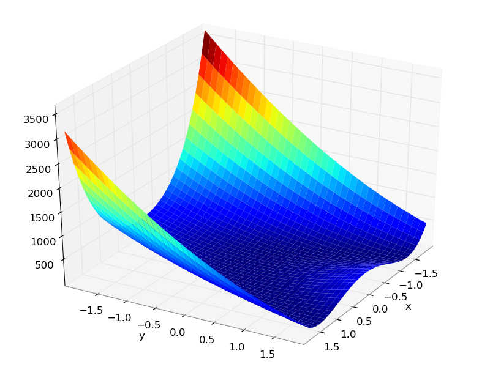

Smolyak Sparse Grid Algorithm
=============================

In the last two sections, we have used :doc:`mc` and :doc:`lhs` on the Rosenbrock function. Both of those algorithms suffered from some common
problems; they were slow to converge on a correct answer and their results
were non-deterministic, varying from run to run due to the inherent randomness.

The Smolyak algorithm is a significant improvement. It uses a smaller
number of runs to generate a response surface.

To move from Monte Carlo to Latin Hypercube sampling, we had to change
a single line in our control script. To use Smolyak, we simply change that same
line::

   uq = LHS([x,y], num=num)

to::

   uq = Smolyak([x,y], level=2)

Or use 'rosen.py' in puq/examples/rosen.::

    ~/puq/examples/rosen> puq start rosen
    Saving run to sweep_140682290.hdf5

    Processing <HDF5 dataset "z": shape (13,), type "<f8">
	    Surface   = 301.0*x**2 - 2.0*x + 300.0*y**2 - 266.667*y - 345.667
	    RMSE      = 7.40e+02 (2.05e+01 %)

    SENSITIVITY:
    Var      u*            dev
    -----------------------------
    x    3.9402e+03    5.2374e+03
    y    2.0828e+03    1.8510e+03

The puq program first created a file using the unique id it generated. That file is sweep_140682290.hdf5.
All information about this run is placed in there.  The puq program next ran 13 jobs, using the parameters
calculated by the Smolyak method. Then it calculated a response surface.

For the Smolyak method, the response surface should ge a perfect fit if the polynomial degree of the function is less than or equal to
the Smolyak level parameter.  For our example, we used a level 2 Smolyak run to approzimate a The Rosenbrock function, which is 4th degree.  Because of this, the response surface does not exactly fit the data points.  The RMSE is 20.5%.

PUQ also calculates the sensitivity of the parameters using the `Elementary Effects Method <http://en.wikipedia.org/wiki/Elementary_effects_method>`_

We can plot the response surface and pdf::

    ~/puq/examples/rosen> puq plot -r sweep_140682290.hdf5
    plotting PDF for z

And if you look at the response surface, you see the actual data as blue dots. Many of them are not on the response surface, indicating a bad fit.

.. figure:: images/z-surface-level2.png
   :width: 500px
   :align: left

   **This is the output from a level-2 Smolyak, which required 13 jobs.**

For comparison, here is the expected rosenbrock function.

   **This is the rosenbrock function.**

Next, if we bring up an editor and change the Smolyak level first to 3 then to 4, or do 'puq extend' twice, we get the following.

.. figure:: images/z-surface-level3.png
   :width: 500px
   :align: left

   **This is the output from a level-3 Smolyak, which required 29 jobs**

::

     ~/puq/examples/rosen> puq extend sweep_140682290.hdf5
    Extending sweep_140682290.hdf5 Using Smolyak
    Extending Smolyak to level 3

    Processing <HDF5 dataset "z": shape (29,), type "<f8">
	    Surface   = -200.0*x**2*y + 343.857*x**2 - 2.0*x + 100.0*y**2 - 136.143
	    RMSE      = 2.40e+02 (6.66e+00 %)

    SENSITIVITY:
    Var      u*            dev
    -----------------------------
    x    4.8307e+03    6.5106e+03
    y    2.0022e+03    1.7623e+03

.. figure:: images/z-surface-level4.png
   :width: 500px
   :align: left

   **This is the output from a level-4 Smolyak, which required 65 jobs**

::

    ~/puq/examples/rosen> puq extend sweep_140682290_A.hdf5
    Extending sweep_140682290.hdf5 using Smolyak
    Extending Smolyak to level 4

    Processing <HDF5 dataset "z": shape (65,), type "<f8">
	    Surface   = 100.0*x**4 - 200.0*x**2*y + 1.0*x**2 - 2.0*x + 100.0*y**2 + 1.0
	    RMSE      = 3.96e-09 (1.10e-10 %)

    SENSITIVITY:
    Var      u*            dev
    -----------------------------
    x    5.0835e+03    6.9637e+03
    y    1.9661e+03    1.7441e+03

.. figure:: images/z-level4.png
   :width: 500px
   :align: left

   **PDF for Smolyak level 4, Rosenbrock function on [-2,2]**

With 65 samples Smolyak outperforms Monte Carlo with 1000 samples.

.. note::

	Smolyak is only suitable for cases where the response function can be approximated
	as a polynomial, at least over the input range with which we are concerned. For functions
	with abrupt changes or discontinuities, :doc:`lhs` is probably a better choice.

